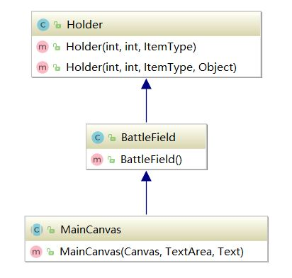
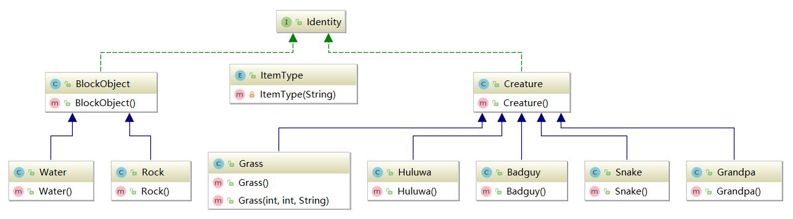

# 随缘战斗葫芦娃  
## 设计思路及效果  

作为一个和平爱好者，当然希望能减少打打杀杀的啦。所以设计的背景是一个战场中
大家相互摸鱼满一分钟就能取得胜利的故事。任意一方胜利条件是消灭对面所有
人物。由于爱好和平的设定，每个人物都是随机走动的，只有有人挡在要行走
的路上才会触发战斗。（所以很多时候都是和平结束的嘻嘻）
在这里为了趣味性，我们给战死的生物加了👻闪烁的效果，以及战斗音乐。
（请戴上耳机 不要被背景音乐吓到...）  
  
P.S.悄悄泄露一下：这里支持自己修改地图文件，就可以创造出一个罗马斗兽场
的环境，由于路径可选择性增加，战斗的场面就会增加了。参见回放中的“36秒战斗”
就是在山林地图下完成的战斗。 
**环境配置**  
很奇怪的是我自己电脑java 10环境jar包运行出错，而有些10环境成功了...
所以还在查找问题，但是代码是肯定可以运行的，助教实在报错可以新建项目，
将我的文件复制进去，IDEA开发环境下设置编译器java 8（实测可以）实在不行
希望能联系我为助教视频演示。    
**使用说明**：   
默认的按下空格键或者A键时开始战斗（方向键会改变空格键的执行命令），
按下L读取复盘，按下S储存上一次的战斗（需要在一次战斗完成后才可以）。  
还可以自己选择妖怪的阵型和地图。目前只有三种阵型，两种地图，接下来会继续开发
DLC（😂如果还有机会的话）
我自己提供的素材是对应resources文件夹下面的"妖怪生猛"，可以
读档使用。  
注意：！！在战斗未结束请不要再次点击战斗！葫芦娃不是孙悟空！不会分身术！
（说到分身术，想起中美合拍的……文体两开花，请大家多多关注）
  
效果图如下： 

妖怪获胜的结果：

## 对象设计 
 Main类首先是需要读取一个FXML文件，启动游戏界面。类之间的关系如下：

    
在javafx中，Controller类负责处理有关UI的设计，比如监听按键，显示背景
等。而真正处理这些事件的是MainCanvas类。顾名思义，MainCanvas类有
canvas对象，作为画板负责刷新图片，实时显示战况。  
BattleField类是用于储存地图的类。封装了对地图的更新处理，包括读取地图、
安排生物体占据地图中的每个位置等。地图是一个Holder对象的二维数组，
Holder类中保存了这个位置上所存在的物体的信息，以及可以访问该位置上的生物。    
  

下面是各个系统（根据SRP原则，基本一个系统作为一个类）  
### 生物系统和地图中的阻碍物  
 
生物体有关的类继承于Creature类，包括葫芦娃的类，爷爷的类，蛇精的类等，
这样设计主要是考虑了这些生物的共性，都有血量HP，有攻击力，有对应的图片
路径名，可以访问这些相同的量。在共性之上，葫芦娃、蛇精由于属性不同，所以
作为Creature的继承来继续完善。可以通过Override相关的函数得到葫芦娃
不同的特性，给葫芦娃添加不同的技能。  
这个设计可以继续扩展葫芦娃和爷爷特定的功能，有利于代码迭代修改。 
  
利用ItemType枚举类可以提高代码可读性。  
与生物体相对应的有BlockObject类。它没有血量等，只是作为地图上一个阻碍物
存在，所以单独独立出来一个类。阻碍物也分Water和Rock，有不同的特性可以
继续扩展。   
Creature类和BlockObject类都实现了Identity接口。这个接口用于访问
这些物体的图片显示，只有能在UI中有图片显示的对象才实现这个接口。
这样做的好处是通过Identity接口我们就能确定在UI
中对应图片，我们只能显示有这个接口的生物体。同时接口的好处也便于以后
各个生物体图片的修改，这样就不用跨文件地修改有关图片代码。  

### UI系统  
UI系统靠读取fxml文件和Controller类响应信息。而真正实现UI刷新绘制
的交给MainCanvas对象。MainCanvas中有对应的Canvas对象，而
JavaFX的UI绘图靠对Canvas操作实现。 在Canvas对象中的GraphicContext
提供了绘图函数。UI的显示就是有一个用于实现利用AnimationTimer的作用，来刷新UI。
AnimationTimer是javafx提供的一个用于动画效果的类，
可以理解为游戏中常说的刷新帧的效果。它每隔固定时间就刷新UI。
在刷新UI时，AnimationTimer中访问各个生物体相关的线程，
显示生物体信息显和当前时间在UI中，并且记录当前存活的生物体数量，
用于判断战斗是否结束。  

### 地图系统
地图系统是BattleField的一个新功能，在初始化地图的时候调用对应函数
读取相应文件，得到阻碍物位置信息，达到地图多样化的效果。  
### 键盘监听
键盘监听实际上一个响应的函数，根据监听的结果就可以调用相对应的开始战斗、
保存信息、打开信息的函数。
### 战斗系统
战斗是在地图中获得双方的战斗力，这就是继承自Creature的方便。Creature都有
一个接口得到战斗力的数值，并且可以对HP进行处理。战斗力低的会HP-1，
如果HP降低到0就会进入死亡状态，在地图中占据一个格子的类型需要改成非生物类型，
该生物对应的线程结束运行。
### 文件系统
在刷新UI的时候文件系统开始记录。这里我们使用的是txt格式进行记录
（实际上可以使用XML来记录，可以在接下来的迭代中完成）。
记录下这次刷新UI时各个生物体所在的坐标和资源文件对应的图片信息。
记录的读取就是重新利用AnimationTimer的过程。每次刷新UI的时候就是
读取对应一次文件的过程。文件记录的信息提供了UI的实况，
按照对应坐标和资源文件就可以复盘战斗了。
### Bullet类
Bullet对象的出现是为了满足显示攻击来源的需求。
Bullet对象实际上就是一个动画。攻击的线程向UI线程中记录子弹的
ArrayList中添加一个Bullet对象就是增加一个动画显示。在刷新UI
的时候访问所有Bullet的位置信息并显示。
### 多线程处理  
将访问地图BattleField中的函数加上synchronized，防止其他对象对
地图进行同步修改而出现生物体撞在同一个位置的情况  
## 运用的面向对象的设计原则：  
- Single-Responsibility Principle 单一职责原则：
将对地图的处理封装成一个类，BattleField处理多线程的地图对象。
尽量做到了一个类一个功能。  
- 继承中多态的灵活使用：获取生物体信息比如攻击力的时候利用葫芦娃、蛇精
的继承关系可以在减少使用RTTI的情况下做到得到对象的信息，符合 LSP原则。  
- 运用工厂模式设计，将生物体的创建交给CreatureFactory类，对葫芦娃
的分配封装，得到的就是按顺序的葫芦娃对象。
- 实际上，我发现部分代码如果在下一次的程序开发中可复用性较差，
可以进一步进行抽象化或是解耦达到更好的编程设计，这个可以待下一步的修正。  

## 感悟  
第一次使用Java完成一个大项目，做下来踩了不少坑，特别是多线程与UI刷新
部分。但是在完成过程中由于对面向对象理解不够深刻，设计时考虑不是很周全
，导致现在看来自己还有很大的进步空间。还是想说选这门课不算后悔！  
最后感谢曹老师和余老师对课程的精心设计以及助教的辛勤付出~新年快乐❤

